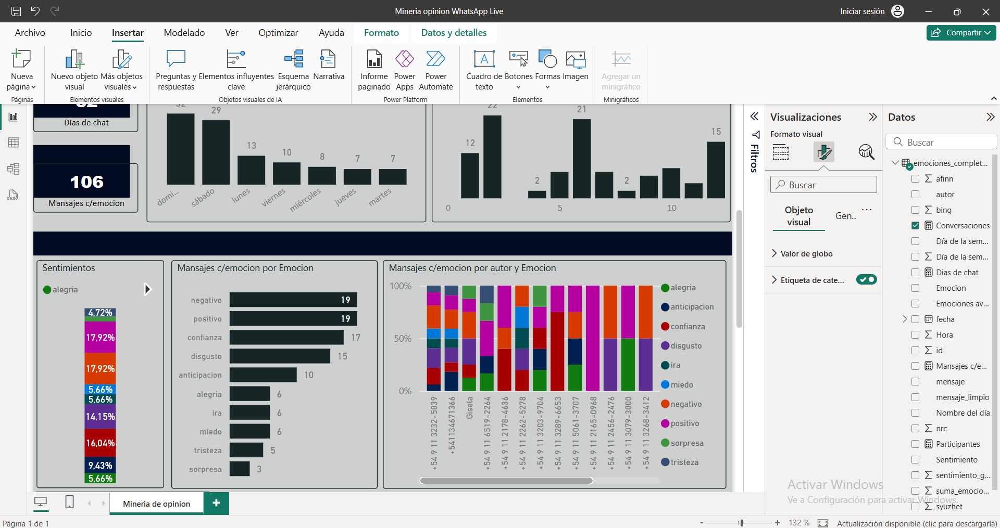

# 🧠 Minería de Opinión en WhatsApp con R y Power BI

Este proyecto aplica técnicas de procesamiento de lenguaje natural y análisis de sentimiento para extraer y visualizar emociones a partir de los mensajes de un grupo de WhatsApp. La información se limpia, transforma y analiza en R, y se visualiza de forma interactiva mediante Power BI.

## 📊 Objetivo

El objetivo principal es detectar patrones emocionales y de participación dentro de un grupo de chat, con foco en el análisis cuantitativo y cualitativo de los sentimientos y emociones presentes en los mensajes.

## 🛠️ Tecnologías utilizadas

- **R**: Limpieza de texto, tokenización, análisis de sentimiento y emociones (paquete `syuzhet`)
- **Power BI**: Dashboard interactivo para visualización de datos
- **GitHub**: Publicación del proyecto como portafolio profesional

## 🧪 Funcionalidades del análisis

- Extracción de emociones básicas (alegría, miedo, ira, sorpresa, etc.) mediante el léxico NRC
- Cálculo de puntajes sentimentales con métodos `syuzhet`, `bing`, `afinn`, `nrc`
- Clasificación de mensajes como positivos, negativos o neutros
- Conversión a formato largo para visualización dinámica
- Segmentación por autor, día, y tipo de emoción

## 📂 Contenido del repositorio

---

## 📊 Funcionalidades

- Extracción de emociones básicas (`alegría`, `miedo`, `ira`, etc.)
- Puntajes sentimentales (`afinn`, `bing`, `syuzhet`, `nrc`)
- Clasificación por tipo de sentimiento (`Positivo`, `Negativo`, `Neutro`)
- Visualización por autor, día de la semana, hora, y emoción predominante
- Segmentación dinámica e interactiva en Power BI

---

## 🖼️ Vista previa

---

## 📌 Notas

- Proyecto realizado sin herramientas de pago.
- Toda la lógica de procesamiento se encuentra disponible en el script `.R`.
- El archivo `.pbix` está listo para abrirse con Power BI Desktop.

---

## 👤 Autor

Mauricio Ríos  
📍 Buenos Aires, Argentina  
🔗 [GitHub: gianRioss](https://github.com/gianRioss)
